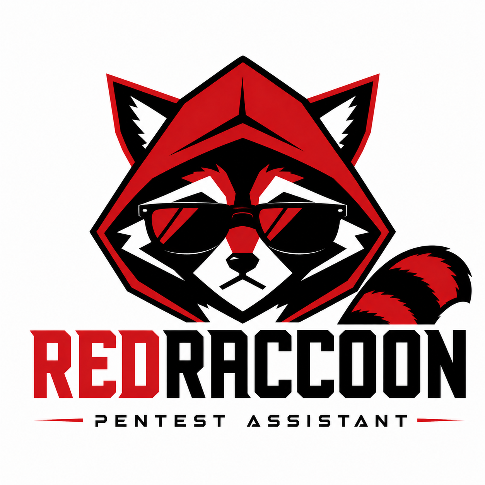

  

Cada vez mais o pentester usa IA na nuvem para ler e avaliar output de ferramenta — nmap, NetExec, Impacket, o que o engagement pedir. O ganho de velocidade é real. O risco também: IP, hostname, domínio, nome de pessoa e e-mail do cliente atravessam o contrato e param em um modelo de terceiros. Em muitos scopes isso não é atalho. É quebra de confidencialidade.

O RedRaccoon existe para esse furo. É um filtro **local**: sanitiza dados sensíveis **antes** de o texto ir para a nuvem, e reconstrói os valores reais **depois**, quando a resposta volta. A assistência de IA continua forte. O identificador do cliente não viaja em claro.

Humano no loop: a app mostra o resumo do que mascarou; **ACEPT** confirma e copia o texto sanitizado; **CANCEL** descarta a rodada. Nada sobe sozinho.

## Ficha técnica

| Peça | Como está feito |
|------|-----------------|
| O quê | Desktop local (Linux). Intermediário entre o terminal e a IA na nuvem. |
| Linguagem | Python 3.13+ |
| UI | PySide6 — janela compacta, avatar, balão, PAST INPUT, Questions |
| Sanitização | Determinística, **sem LLM** no filtro: blocklist do engagement → regex → Microsoft Presidio + spaCy |
| Placeholders | Consistentes no engagement (`TARGET_IP_1`, `TARGET_HOST_1`, …) |
| Persistência | SQLite **dentro** do workspace do engagement; queima da base no fechar (recomendado) |
| Clipboard | `pyperclip` — scan entra por PAST INPUT; a UI não despeja o output inteiro |
| Segredo de API | Nenhum. Tudo roda na máquina. |
| Fora da v1 | OCR, interceptor MCP do Cursor, `.docx`/PDF, Windows `.exe`, vários engagements em paralelo |

O código está organizado por responsabilidade (`app/`, `core/`, `db/`, `session/`, `ui/`) para poder ser lido e auditado — o filtro não é uma caixa preta.

## Conclusão

O RedRaccoon não promete magia nem “zero leak” absoluto. Promete um intermediário rápido, previsível e com o pentester no controle: mascarar o que é do cliente, deixar intacto o que a IA precisa para analisar (CVE, versão, protocolo), e devolver o mundo real quando o trabalho pede.

O produto está em **fase de construção e polimento**. Em breve segue para uma fase de testes com usuários testers — o momento de usar de verdade, achar aresta e afiar antes de qualquer distribuição mais ampla.
